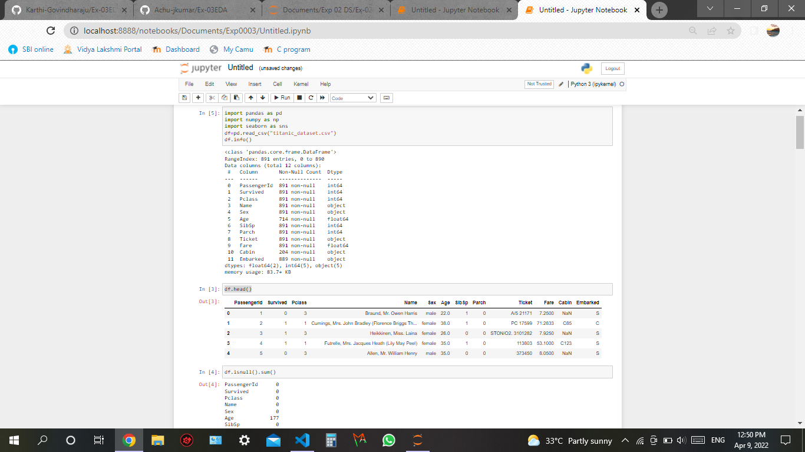
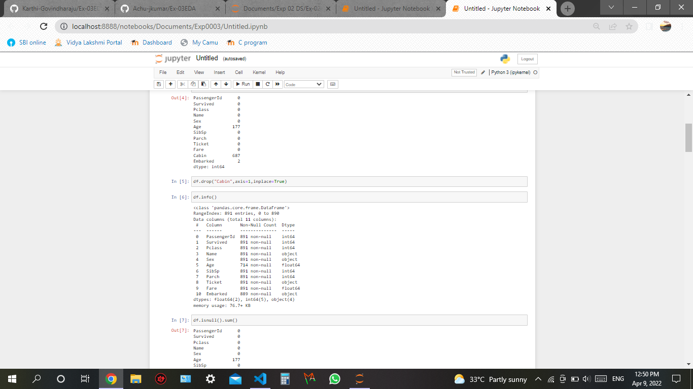
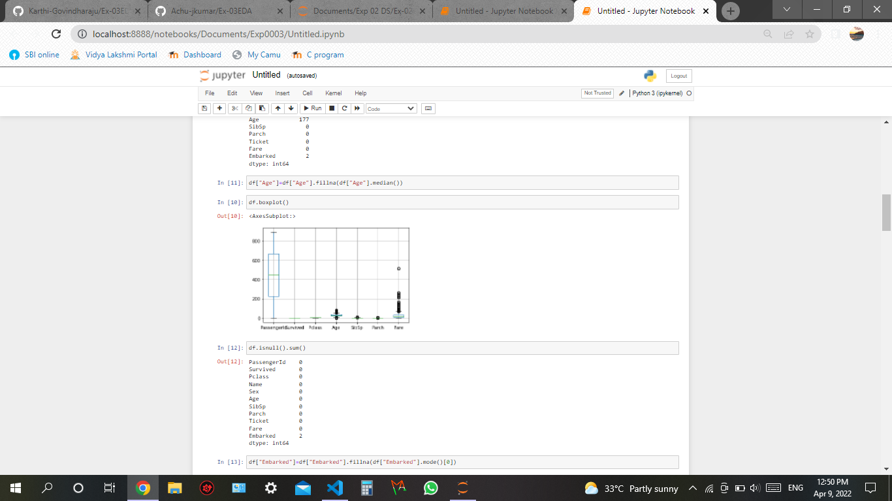
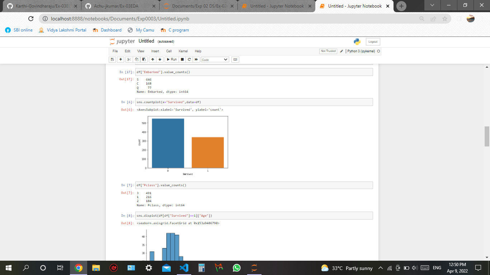
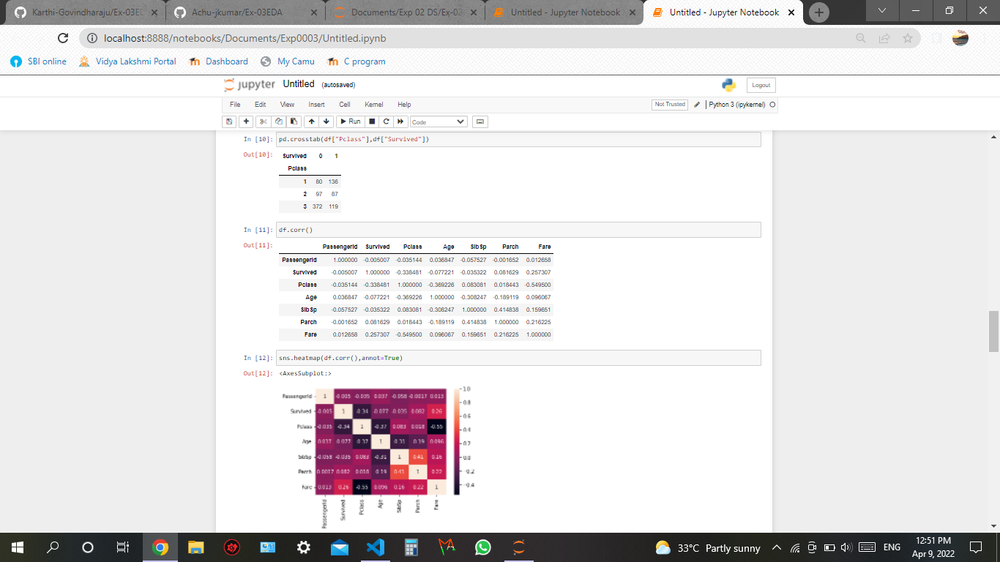
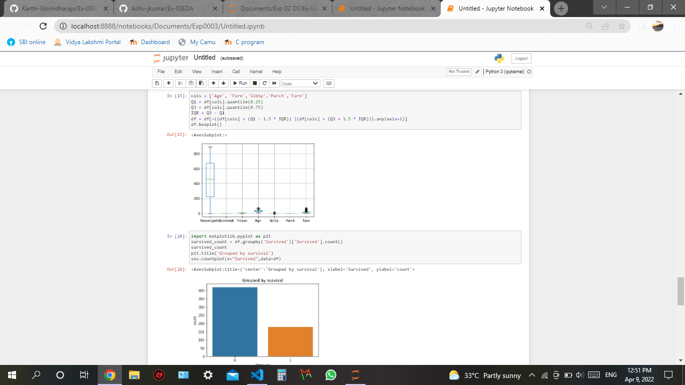
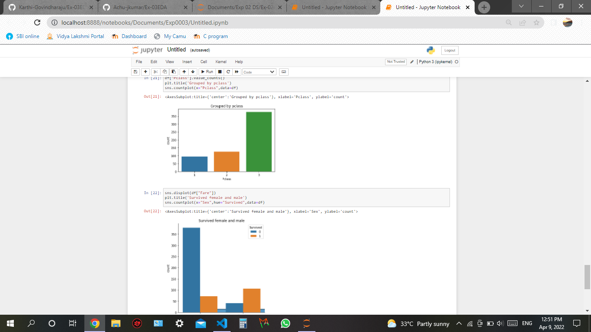
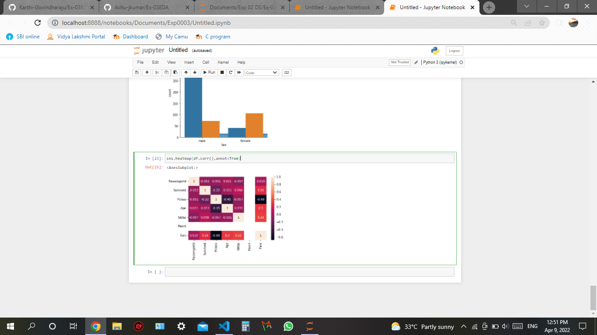

# Ex-03EDA

## AIM
To perform EDA on the given data set. 

# Explanation
The primary aim with exploratory analysis is to examine the data for distribution, outliers and 
anomalies to direct specific testing of your hypothesis.
 

# ALGORITHM
### STEP 1
 Import the built libraries required to perform EDA and outlier removal.
### STEP 2
Use seaborn the bar graph comparison of data can be viewed.
### STEP 3
Using crosstab the numerical data on the dataset can be compared and viewed. 
### STEP 4
The heatmap is used to represent the difference between the values. 


# CODE:
```
import pandas as pd
import numpy as np
import seaborn as sns
df=pd.read_csv("titanic_dataset.csv")
df.info()

df.head()
df.isnull().sum()
df.drop("Cabin",axis=1,inplace=True)
df.info()
df.isnull().sum()
df["Age"]=df["Age"].fillna(df["Age"].median())
df.boxplot()
df.isnull().sum()

df["Embarked"]=df["Embarked"].fillna(df["Embarked"].mode()[0])
df["Embarked"].value_counts()
sns.countplot(x="Survived",data=df)


df["Pclass"].value_counts()
sns.displot(df[df["Survived"]==1]["Age"])
pd.crosstab(df["Pclass"],df["Survived"])
df.corr()

sns.heatmap(df.corr(),annot=True)


df=pd.read_csv("titanic_dataset.csv")
z=np.abs(stats.zscore(df))
z


cols = ['Age', 'Fare','SibSp','Parch','Fare']
Q1 = df[cols].quantile(0.25)
Q3 = df[cols].quantile(0.75)
IQR = Q3 - Q1
df = df[~((df[cols] < (Q1 - 1.5 * IQR)) |(df[cols] > (Q3 + 1.5 * IQR))).any(axis=1)]
df.boxplot()

import matplotlib.pyplot as plt
survived_count = df.groupby('Survived')['Survived'].count()
survived_count
plt.title('Grouped by survival')
sns.countplot(x="Survived",data=df)

df["Pclass"].value_counts()
plt.title('Grouped by pclass')
sns.countplot(x="Pclass",data=df)

sns.displot(df["Fare"])
plt.title('Survived female and male')
sns.countplot(x="Sex",hue="Survived",data=df)

sns.heatmap(df.coor(),annot=True)
```
# OUPUT:









# Result :
 The program to  perform EDA on the given data set is successfully executed.

